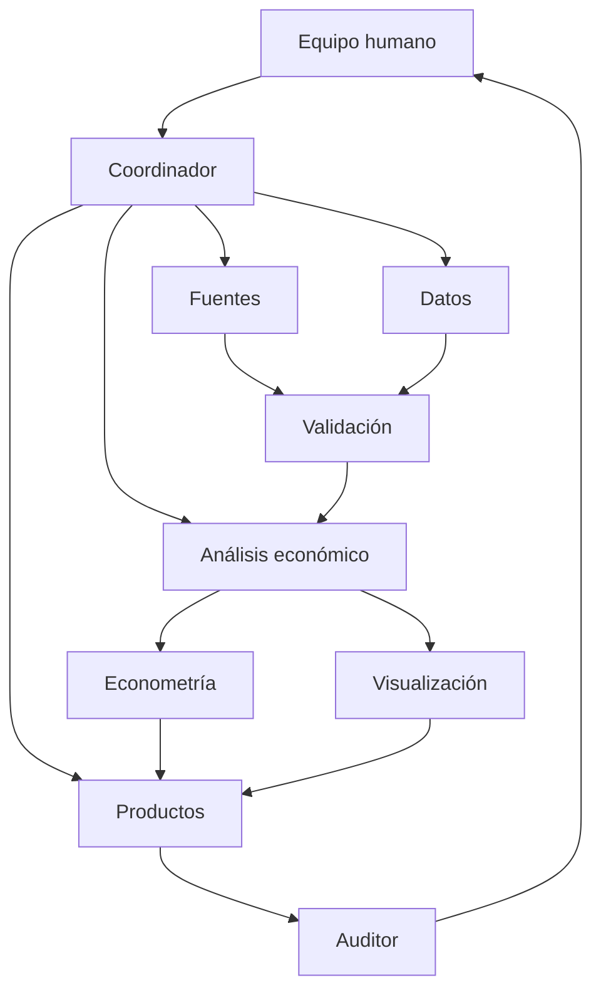

# Arquitectura multiagente

## Diseño

## Capas

| Capa | Agentes | Salida principal |
|---|---|---|
| Gobierno | Coordinador + equipo humano | alcance y decisiones |
| Evidencia | Fuentes + datos | registro y datos crudos |
| Calidad | Validación | reporte de calidad |
| Análisis | Económico + econométrico | indicadores y modelos |
| Comunicación | Visualización + redacción | dashboard e informe |
| Control | Auditor | dictamen de entrega |

## Ejemplo de flujo trazable

1. Fuentes verifica la definición del indicador de homicidios.
2. Datos descarga la respuesta original y guarda parámetros.
3. Validación detecta faltantes, duplicados y saltos extremos.
4. Análisis calcula tendencias y comparaciones.
5. Econometría estima asociaciones no causales, contemporáneas y rezagadas.
6. Visualización publica gráficos con unidad y fuente.
7. Redacción integra resultados aprobados.
8. Auditor contrasta cada afirmación contra su dato.
9. Un integrante valida y firma la bitácora.

## Puertas humanas

No se automatizan la aprobación del problema, la equivalencia conceptual de
las fuentes, el tratamiento de atípicos, la interpretación económica ni el
dictamen final.
